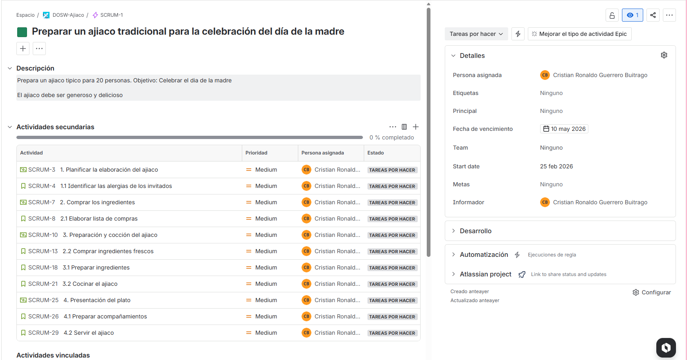
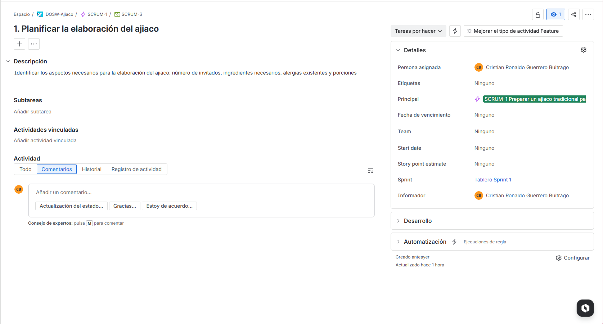
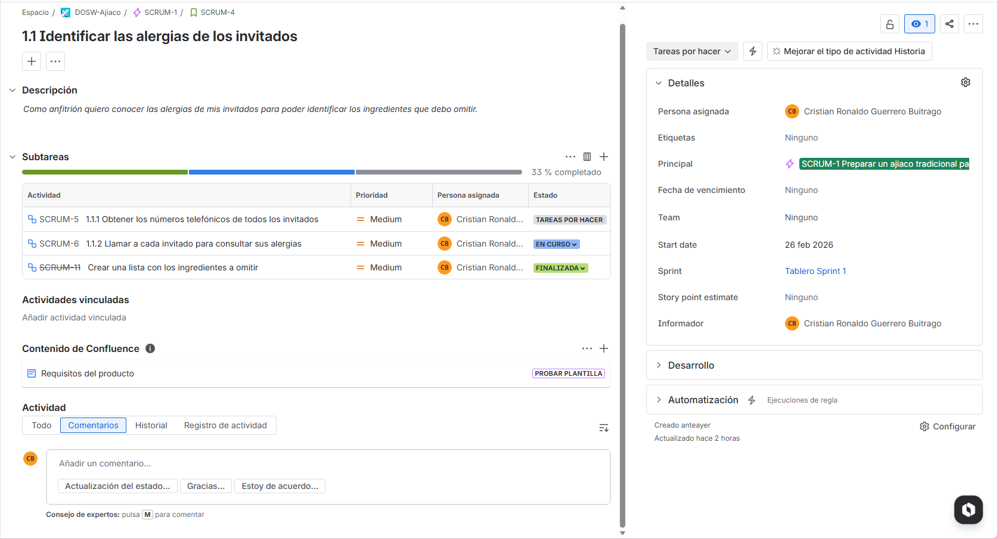
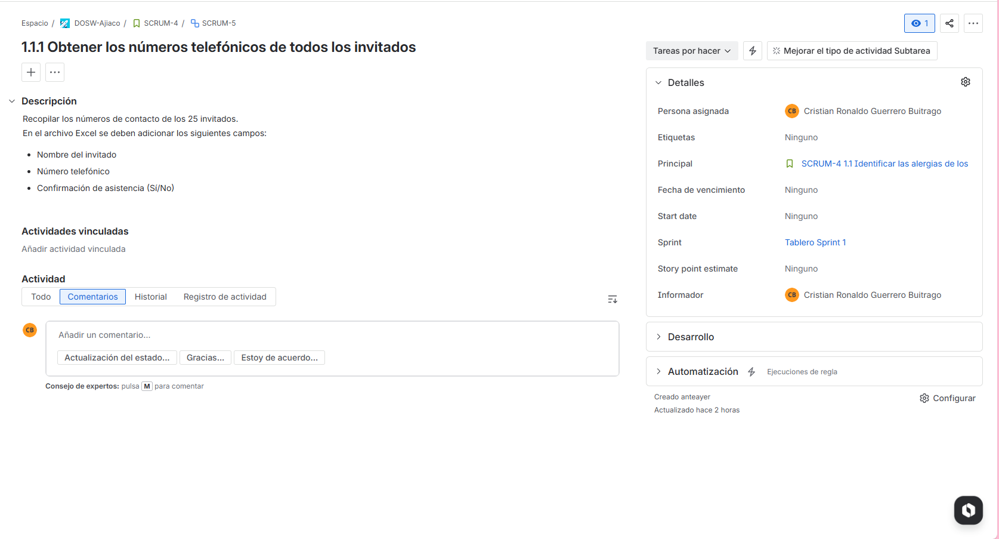

# Ejercicio de elaboracion de ajiaco con Jira

### Epica

### Feature

### HU

### Tareas

Link: https://team-dosw-cristian.atlassian.net/jira/software/projects/SCRUM/boards/2?atlOrigin=eyJpIjoiNTUxMmExMjg2NGY4NGE4Y2JiMjYxNTk3Nzk5NzQyOTEiLCJwIjoiaiJ9