# Refuerzo – Combinación de Patrones de Diseño
El objetivo de este refuerzo es practicar la combinación de patrones de diseño dentro de un mismo sistema, entendiendo 
cómo se complementan para resolver problemas reales de software.
Para cada ejercicio deberán realizar:
1. Identificar por cada uno de los patrones de diseño utilizados:
- Nombre del Patrón 
- Tipo del Patrón
- Justificación Técnica
2. Realizar el diagrama de clases UML mostrando claramente las relaciones entre las clases.
3. Implementar la solución en código.
4. Crear pruebas unitarias que validen el comportamiento del sistema con JUnit
5. Generar cobertura de código con Jacoco
6. Realizar análisis estático del código utilizando herramientas como Sonar

### Ejercicio 1: Sistema de Notificaciones
Una empresa necesita un sistema que envíe notificaciones a los usuarios a través de diferentes canales como:
- Email, SMS y Push Notification

El sistema debe permitir que el tipo de notificación pueda cambiar dinámicamente, dependiendo del canal seleccionado.
Además, se requiere que todas las notificaciones pasen por un servicio centralizado que gestione el envío, para evitar 
múltiples instancias del servicio en el sistema.
#### Requisitos
- El sistema debe permitir agregar nuevos tipos de notificación sin modificar el código existente.
- El servicio de envío debe existir una sola vez en el sistema.
- El sistema debe poder cambiar el comportamiento del envío según el canal elegido.

### Patrón 1: Decorator
#### 1.1 Nombre del Patrón
Decorator (Decorador)
#### 1.2 Tipo del Patrón
Estructural
#### 1.3 Justificación Técnica
El enunciado establece que el sistema debe enviar notificaciones a través de Email, SMS y Push Notification, y que el 
tipo de notificación debe cambiar dinámicamente según el canal seleccionado. Además exige que se puedan agregar nuevos 
tipos sin modificar el código existente.La herencia tradicional fallaría aquí porque generaría una explosión combinatoria 
de subclases, como lo explica el documento:

Email, SMS, Push, EmailSMS, EmailPush, SMSPush, EmailSMSPush...

El patrón Decorator resuelve esto porque:

Permite apilar comportamientos en tiempo de ejecución. Un usuario puede recibir Email + SMS + Push simultáneamente 
simplemente envolviendo decoradores uno sobre otro. 

Todos los decoradores implementan la misma interfaz que el notificador 
base, por lo que el cliente no distingue si trabaja con uno o varios canales activos. 

Agregar un nuevo canal como WhatsApp o Slack solo requiere crear un nuevo decorador, sin tocar ninguna clase existente 
→ cumple el principio Open/Closed

### Diagrama

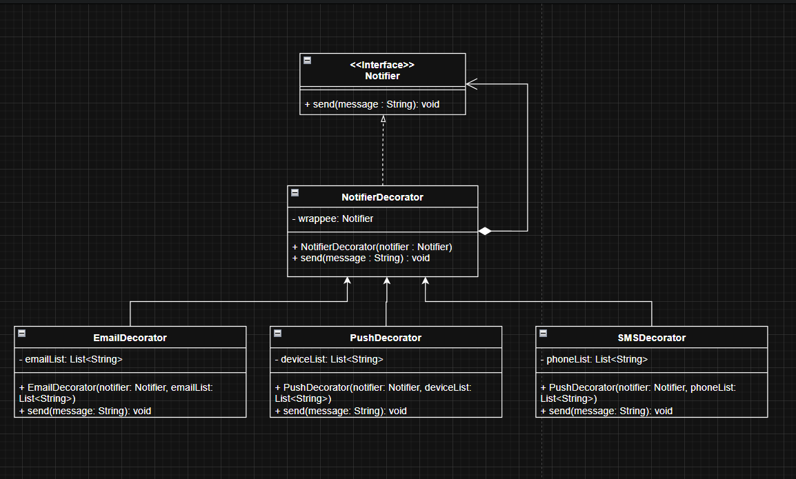

### Patrón 2: Singleton
#### 2.1 Nombre del Patrón
Singleton
#### 2.2 Tipo del Patrón
Creacional
#### 2.3 Justificación Técnica
El enunciado dice explícitamente:

"Se requiere que todas las notificaciones pasen por un servicio centralizado que gestione el envío, para evitar 
múltiples instancias del servicio en el sistema"

Esa es la definición exacta del problema que resuelve Singleton:

Garantiza que el NotificationService tenga una única instancia en toda la aplicación
Proporciona un punto de acceso global a ese servicio desde cualquier parte del sistema
Evita inconsistencias que ocurrirían si múltiples instancias del servicio gestionaran el envío de forma independiente, 
como duplicación de mensajes o condiciones de carrera

### Diagrama

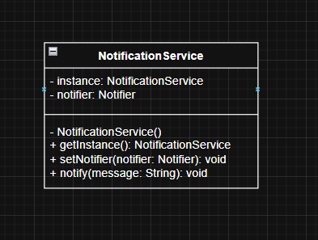

### Diagrama General

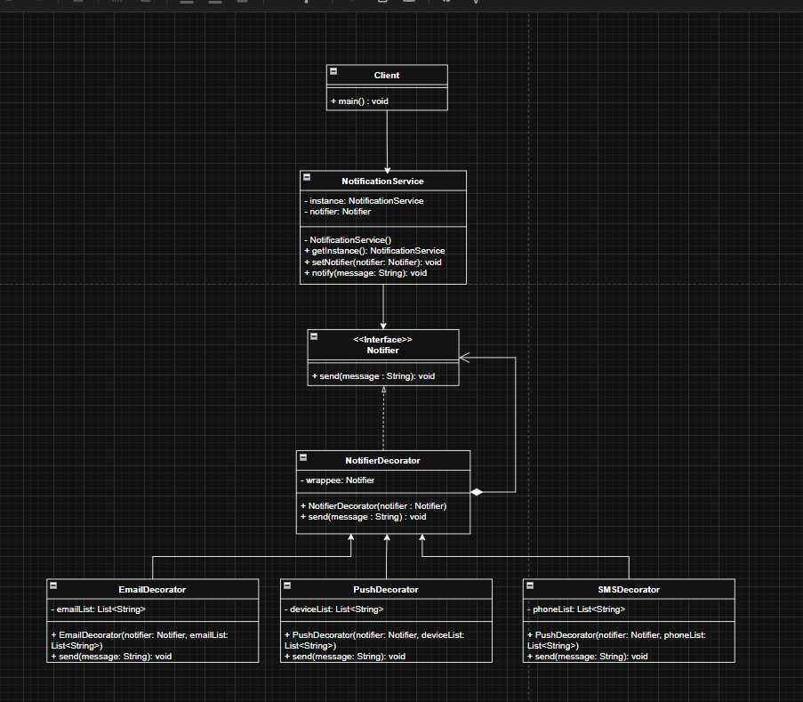

### Generar cobertura de código con Jacoco
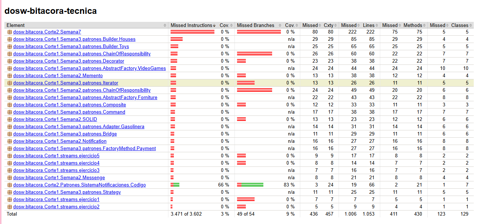

### análisis estático del código 
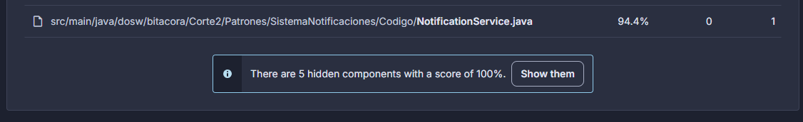

### Ejercicio 2: Sistema de Procesamiento de Pagos
Una plataforma de comercio electrónico necesita procesar pagos usando distintos proveedores:
- PayPal
- Stripe
- Tarjeta de crédito
- Transferencia bancaria

Cada proveedor tiene una API diferente, por lo que se requiere una forma de adaptar esas interfaces al sistema interno.
Además, antes de procesar un pago, el sistema debe ejecutar una serie de validaciones configurables, como:

- Validar saldo
- Validar fraude
- Validar límite de transacciones
- Estas validaciones deben ejecutarse en cadena, donde cada una decide si el proceso continúa o no.

#### Requisitos
El sistema debe poder integrar proveedores externos con diferentes interfaces.
Las validaciones deben poder agregarse o quitarse fácilmente.
El sistema debe permitir agregar nuevos proveedores de pago sin modificar el código principal.

### Patrón 1: Adapter
#### 1.1 Nombre del Patrón
Adapter (Adaptador)
#### 1.2 Tipo del Patrón
Estructural
#### 1.3 Justificación Técnica
El enunciado establece que cada proveedor tiene una API diferente y se requiere adaptarla al sistema interno. 
Sin Adapter, el código principal tendría que conocer la API específica de cada proveedor, generando un acoplamiento fuerte
El patrón Adapter resuelve esto porque:

- Envuelve cada API externa en una clase adaptadora que implementa la interfaz interna del sistema (PaymentProcessor)
- El código principal solo conoce PaymentProcessor.processPayment() sin importar qué proveedor hay detrás
- Agregar un nuevo proveedor solo requiere crear un nuevo Adapter, sin tocar el código existente → cumple el principio Open/Closed

### Patrón 2: Chain of Responsibility
#### 2.1 Nombre del Patrón
Chain of Responsibility (Cadena de Responsabilidad)
#### 2.2 Tipo del Patrón
Comportamental
#### 2.3 Justificación Técnica
El enunciado dice que las validaciones deben ejecutarse en cadena donde cada una decide si el proceso continúa o no, 
y deben poder agregarse o quitarse fácilmente.
Sin Chain of Responsibility, las validaciones estarían anidadas con muchos if uno por cada validacion

El patrón Chain of Responsibility resuelve esto porque:

- Cada validación es un eslabón independiente que decide si pasa la solicitud al siguiente o la detiene
- Las validaciones se pueden agregar, quitar o reordenar simplemente modificando la cadena, sin tocar la lógica de cada validador
- Cada validador tiene una sola responsabilidad → cumple el principio de Single Responsibility
- La cadena es completamente configurable en tiempo de ejecución

### Patrón 3: Abstract Factory
#### 3.1 Nombre del Patrón
Abstract Factory (Fábrica Abstracta)
#### 3.2 Tipo del Patrón
Creacional
#### 3.3 Justificación Técnica
El enunciado exige agregar nuevos proveedores sin modificar el código principal. Cada proveedor representa una familia 
completa de objetos relacionados como por ejemplo su procesador, su configuración y su conexión.
Sin Abstract Factory, el código cliente tendría que instanciar directamente cada proveedor

El patrón Abstract Factory resuelve esto porque:

- Define una interfaz de fábrica (PaymentFactory) que el cliente usa para obtener los objetos sin conocer su implementación concreta
- Cada proveedor tiene su propia fábrica concreta (PayPalFactory, StripeFactory) que crea su familia de objetos
- Agregar un nuevo proveedor como Mercado Pago solo requiere crear una nueva fábrica concreta sin modificar nada existente → cumple el principio Open/Closed
- Garantiza que los objetos creados de una misma familia sean compatibles entre sí

### Diagramas

#### Adapter
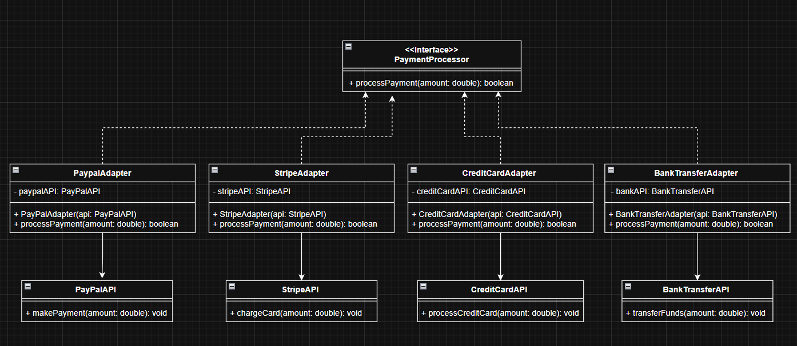

#### Chainf Of Responsability
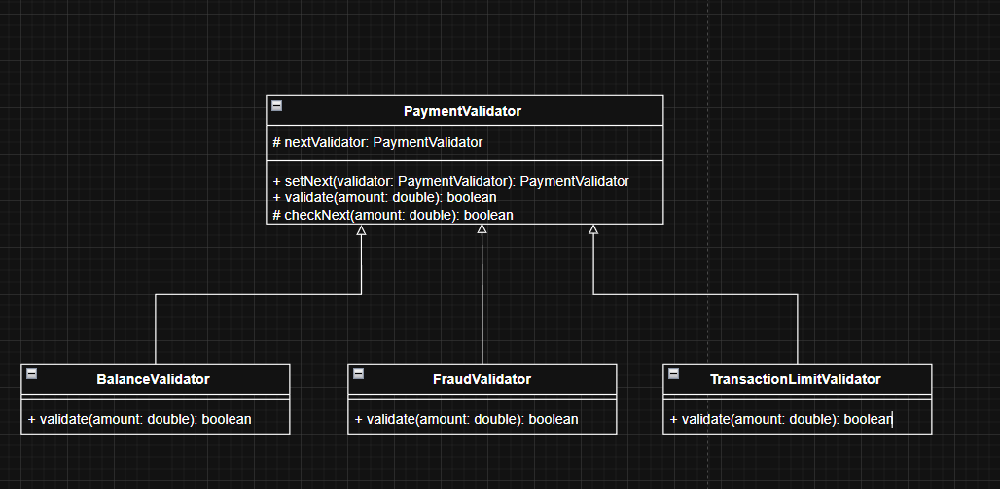

#### Abstract Factory
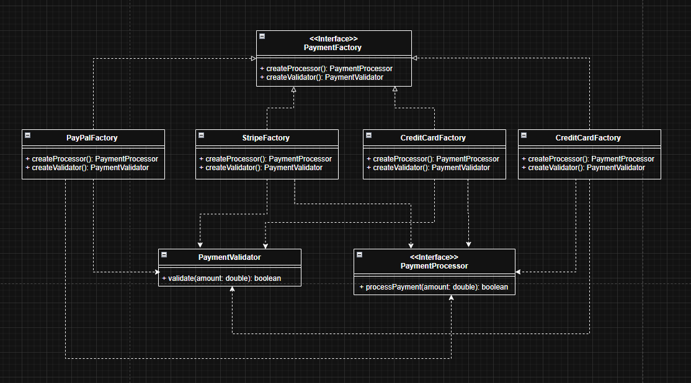

#### Diagrama General
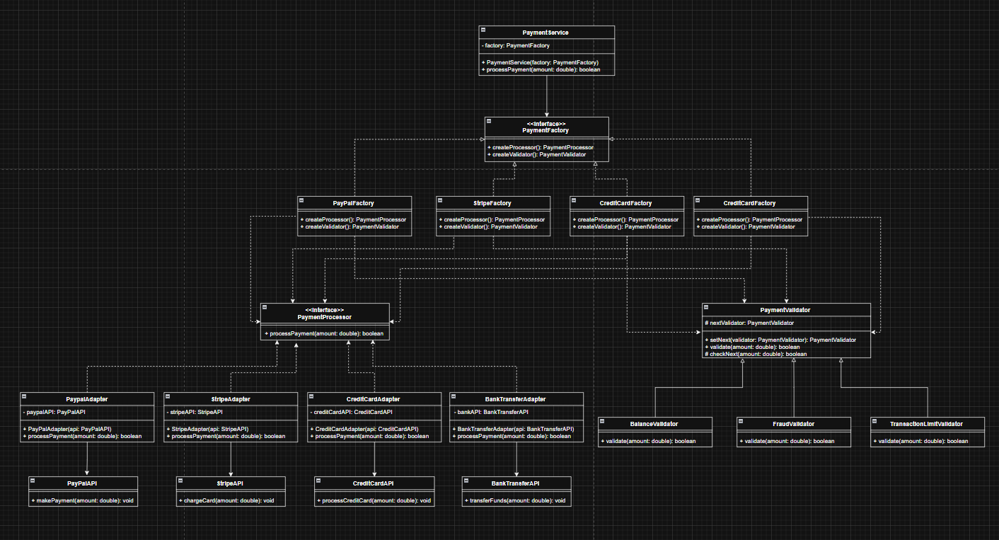

### Generar cobertura de código con Jacoco
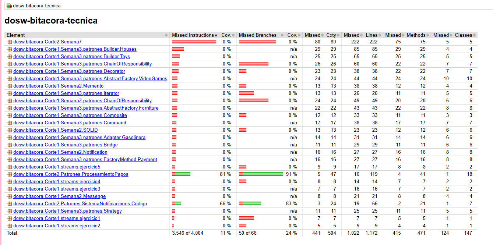

### análisis estático del código 
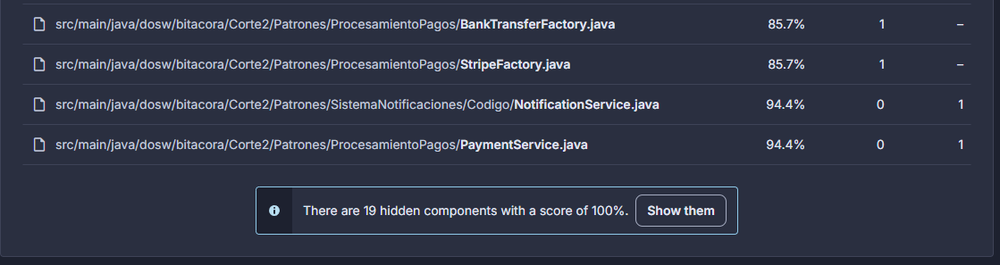

### Ejercicio 3: Sistema de Reportes de una Plataforma
Una plataforma necesita generar reportes de información del sistema, tales como:
- Reportes en PDF
- Reportes en CSV
- Reportes en JSON
El sistema debe permitir que los reportes se construyan paso a paso, agregando diferentes secciones como:
- Información general
- Estadísticas
- Detalle de transacciones
#### Resumen final
Adicionalmente, el sistema debe permitir extender el comportamiento de los reportes, por ejemplo agregando decoraciones como:
- Firma digital
- Marca de agua
- Compresión del archivo
El sistema debe ser flexible para permitir nuevos formatos de reporte y nuevas extensiones sin modificar el código existente.

### Patrón 1: Builder
#### 1.1 Nombre del Patrón
Builder (Constructor)
#### 1.2 Tipo del Patrón
Creacional
#### 1.3 Justificación Técnica
El enunciado establece que los reportes deben construirse paso a paso agregando diferentes secciones como información 
general, estadísticas, detalle de transacciones y resumen final. Sin Builder, la construcción del reporte generaria la 
generacion de diferentes constructores

El patrón Builder resuelve esto porque:

Permite construir el reporte sección por sección de forma fluida y legible, agregando solo las secciones que se necesiten
- Separa la construcción del objeto de su representación final, permitiendo que el mismo proceso de construcción genere diferentes tipos de reporte
- Si se necesita un reporte solo con información general y resumen, no es necesario pasar valores nulos para las secciones que no aplican
- Cumple el principio de Single Responsibility ya que la lógica de construcción queda encapsulada en el Builder y no en el objeto mismo

### Patrón 2: Decorator
#### 2.1 Nombre del Patrón
Decorator (Decorador)
#### 2.2 Tipo del Patrón
Estructural
#### 2.3 Justificación Técnica
El enunciado exige extender el comportamiento de los reportes agregando decoraciones como firma digital, marca de agua 
y compresión, y que esto sea posible sin modificar el código existente.

Sin Decorator, habría que crear subclases para cada combinación posible

El patrón Decorator resuelve esto porque:

Permite apilar decoraciones dinámicamente en tiempo de ejecución sin explotar en subclases
- Todos los decoradores implementan la misma interfaz que el reporte base, por lo que el cliente los trata de forma idéntica
- Agregar una nueva decoración como cifrado solo requiere crear un nuevo decorador sin tocar ninguna clase existente → cumple el principio Open/Closed
- Las decoraciones son combinables libremente: un reporte puede tener firma + marca de agua + compresión en cualquier orden

### Patrón 3: Factory Method
#### 3.1 Nombre del Patrón
Factory Method (Método Fábrica)
#### 3.2 Tipo del Patrón
Creacional
#### 3.3 Justificación Técnica
El enunciado requiere soportar múltiples formatos de reporte (PDF, CSV, JSON) y permitir nuevos formatos sin modificar 
el código existente. Cada formato es una variante del mismo objeto Report con su propia lógica de generación.

Sin Factory Method, el cliente tendría que instanciar directamente cada formato

El patrón Factory Method resuelve esto porque:

- Define un método de fábrica abstracto createReport() que cada subclase implementa para crear su propio formato
- El cliente trabaja con la interfaz Report sin conocer la implementación concreta que hay detrás
- Agregar un nuevo formato como XML solo requiere crear una nueva subclase de la fábrica sin modificar el código existente → cumple el principio Open/Closed
- A diferencia de Abstract Factory, aquí solo se crea un único tipo de objeto por fábrica, que es exactamente lo que necesita este sistema

#### Diagrama Factory Method
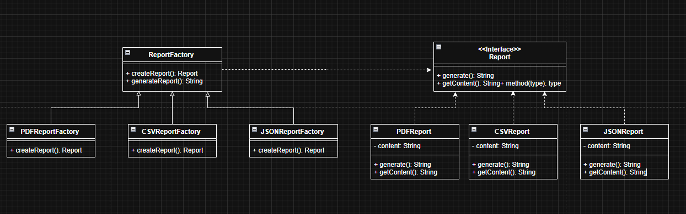

#### Diagrama Builder
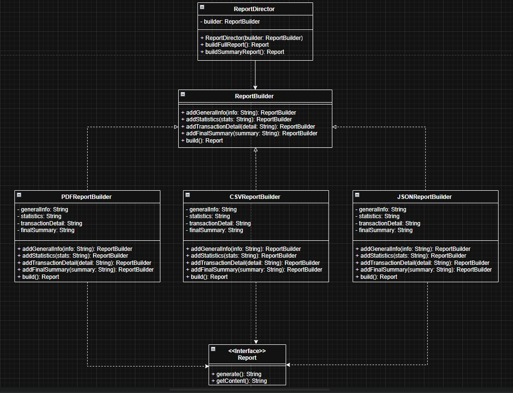

#### Diagrama Decorator
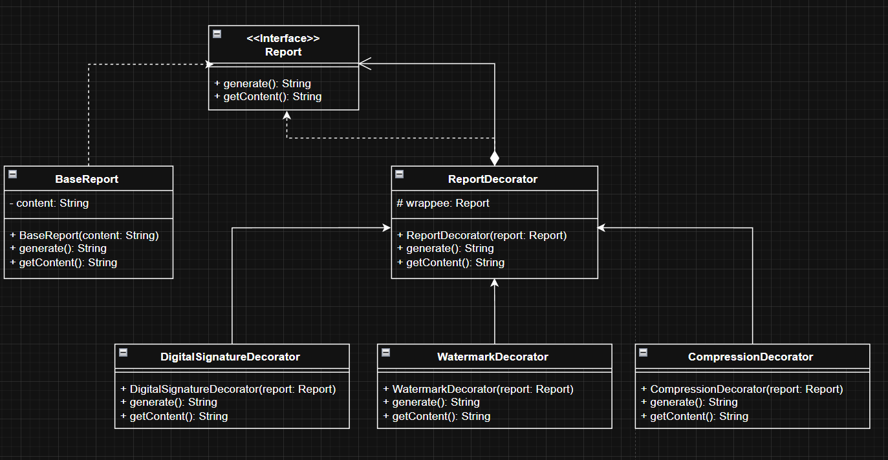

#### Diagrama General
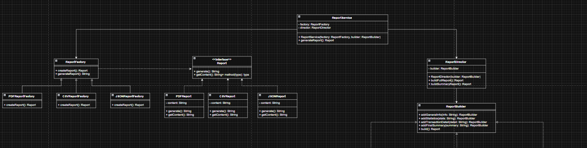

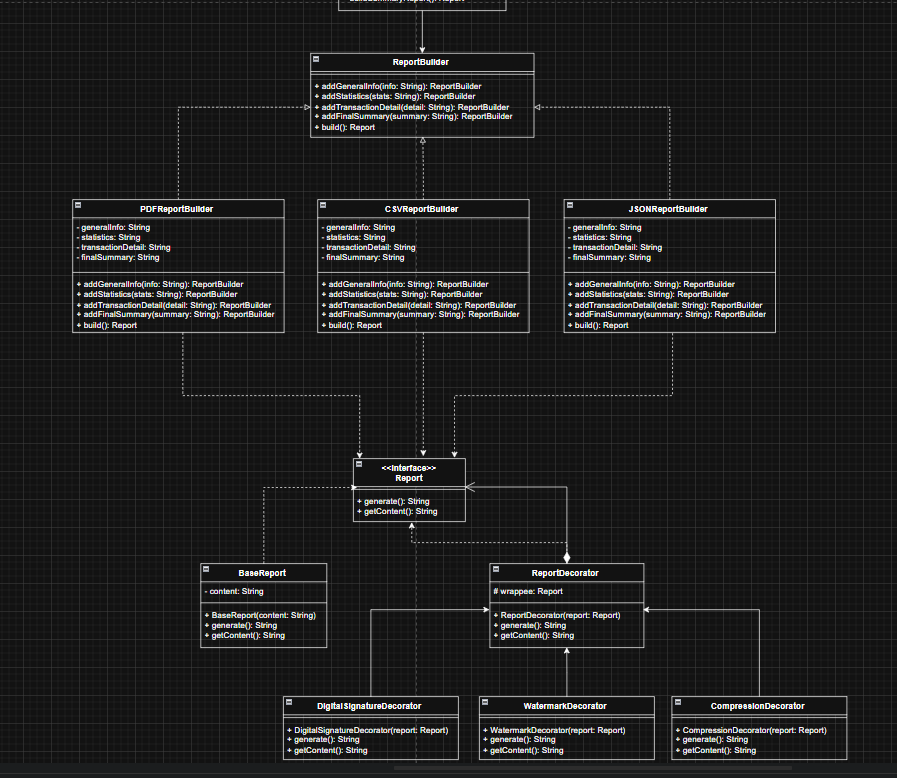

### Generar cobertura de código con Jacoco
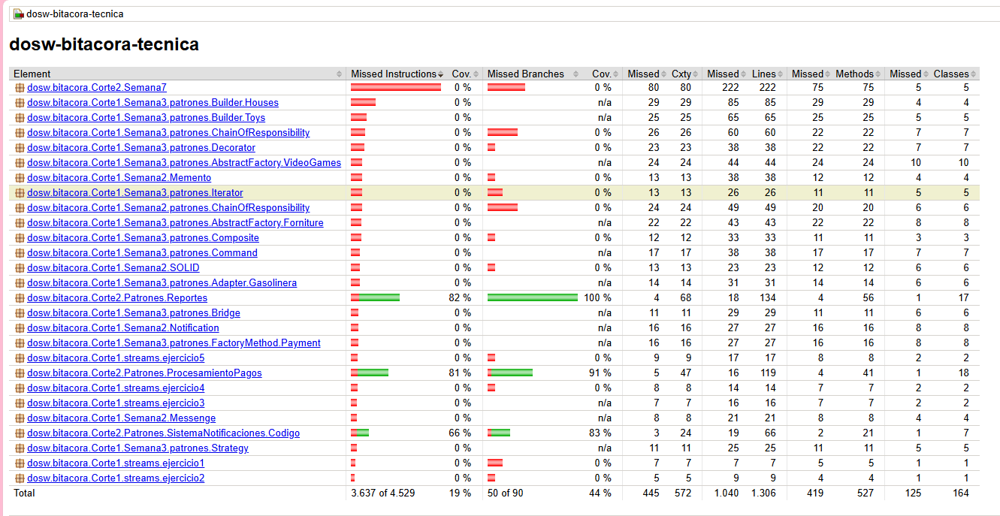

### análisis estático del código 

