# Bitacora semana 1

### Actividades a realizar
Se tiene el siguiente modelo 
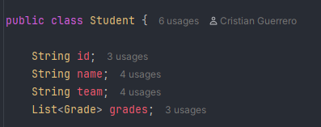
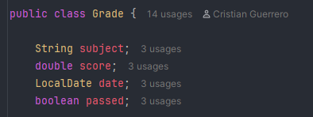

Realizar el siguiente trabajo:

1. Obtener todos los estudiantes del equipo DORADO -> Retornar una lista de estudiantes cuyo team sea DORADO
2. Obtener todos los nombres de estudiantes ordenados Alfabeticamente
3. Calcular el promedio general de todos los score existentes en el sistema
4. Retornar por estudiante el primedio por materia -> Retornar un Map<String, Double> donde la clave es la materia y el valor el promedio
5. Retornar el estudiante cuyo promedio general sea el mas alto del curso
6. Retornar las materias reprobadas por equipo -> Retornar Map <String, Long> donde la clave es el nombre del equipo y el valor la cantidad total de materias reprobadas
7. Top 3 estudiantes con mas materias aprobadas -> Retornar lista ordenada de manera descendente
8. Agrupar estudiantes por estado academico: Clasificarlos por ALTO RENDIMIENTO -> Promedio >=4,5 , REGULAR -> Promedio entre 3,5 y 4.49, RIESGO -> promedio < 3,5
9. Obtener la materia con mas reprobaciones
10. Tome solo estudiantes del equipo DORADO, Obtenga todas sus notas, Filtre solo notas aprobadas, Agrupe por materia, Calcule promedio por materia, Ordene descendente por promedio, Retorne un LinkedHashMap preservando orden.
11. Propuesta realizada por ustedes y explicada
12. Propuesta realizada por ustedes y explicada

### Adjuntar evidencias 
#### 1. Obtener todos los estudiantes del equipo DORADO -> Retornar una lista de estudiantes cuyo team sea DORADO
- Primero se realizaron las clases propuestas por el ejercicio es decir la clase Student y Grade con sus respectivos
constructores, geters y sters.
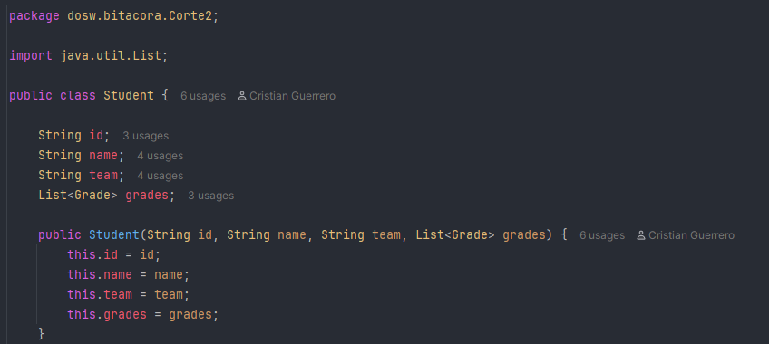
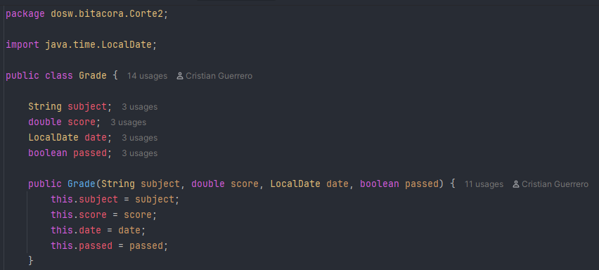
- Acontinuacion se genero una clase la cual va a contener una lista de diferentes estudiantes con su respectiva lista 
de notas, de esta forma podemos reutilizar dicha lista para realizar los diferentes ejercicios propuestos
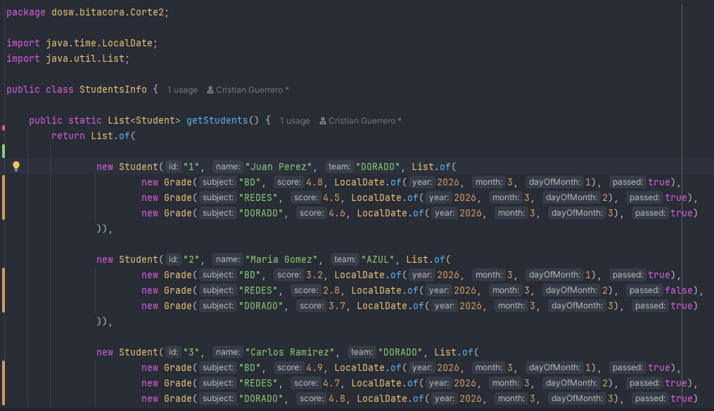
- Despues se genero el codigo que resuelve dicho ejercicio
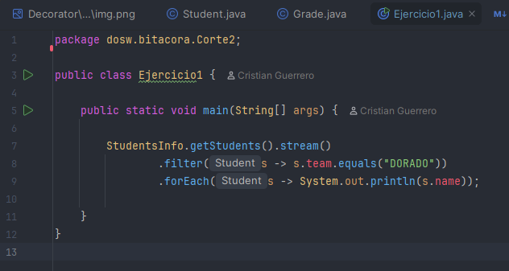
- Como se puede apreciar en la imagen no es necesario crear una lista de estudiantes ya que esta ya se encuentra en la
clase de StudentsInfo, por lo cual solo debemos hacer uso del get y convertirlo a stream, como resultado tenemos lo
siguiente
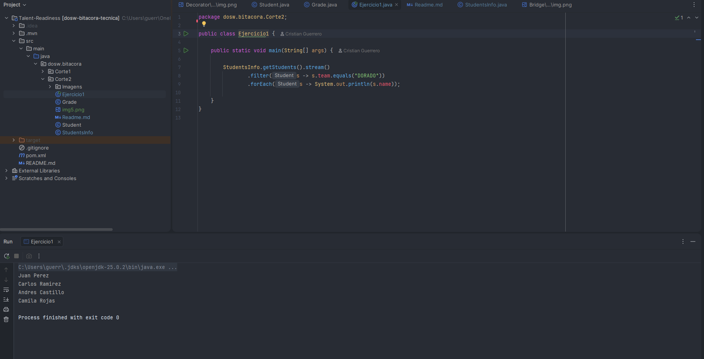
- Realizamos el respectivo Commit y lo subimos al repositorio
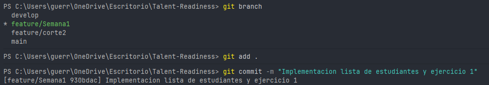

#### 2. Obtener todos los nombres de estudiantes ordenados Alfabeticamente
- Generamos el codigo, usamos la funcion map para extraer el nombre del estudiante para luego usar sorted el cual por
defecto ordena alfabeticamente o de mayor a menor, para por ultimo usar el ForEach para imprimir los nombres
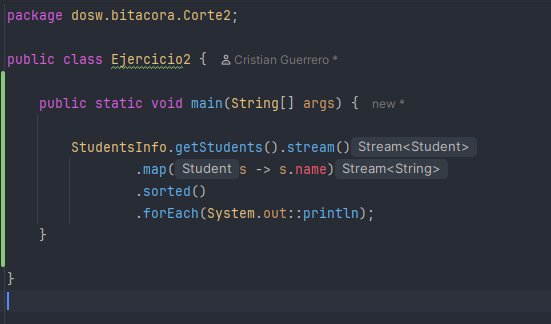
- Al ejecutar el codigo tenemos como resultado lo siguiente 
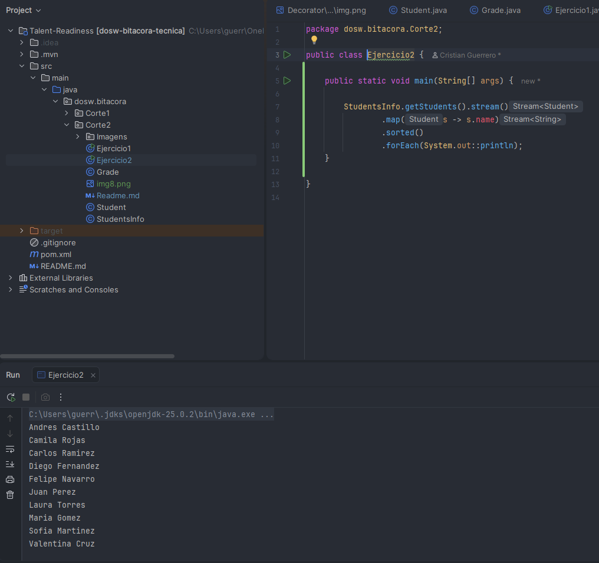
- Generamos el commit y lo subimos al repositorio
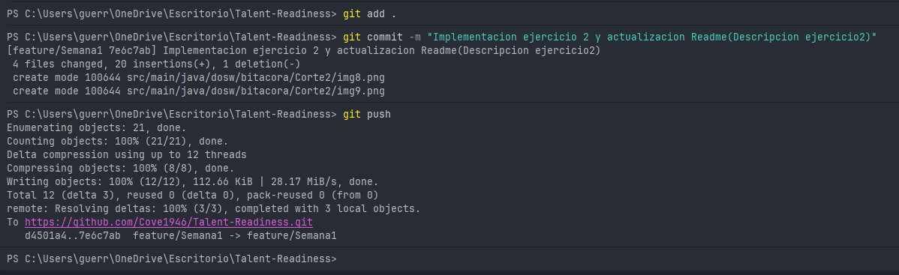

#### Actualizacion
- Con el fin de que el codigo se vea de una forma mas limpia se decidio hacer los diferentes puntos como funciones de
una clase llamada StudentExercise, de esta forma se hace la logica de cada punto en esta clase y en el main solo se hace 
el llamado de dicha clase, ademas de una breve descripcion para saber que de que ejercicio se trata
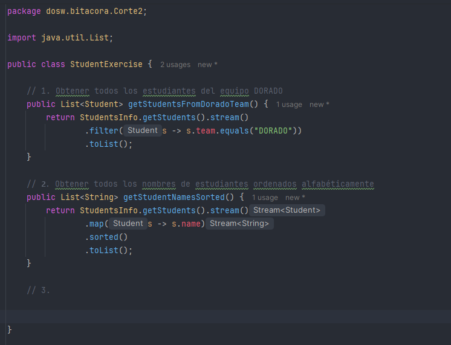
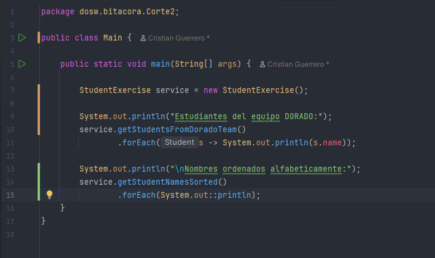
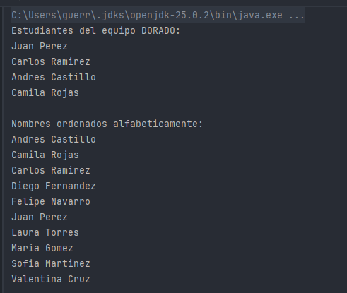

#### 3. Calcular el promedio general de todos los score existentes en el sistema
- Para poder solucionar vamos a tener el problema del usar el map
- Ya que si aplicamos un .map(s -> s.grades) vamos a 
tener como resultado un Stream<List<Grade>>
- Es decir listas dentro del stream, lo cual no sirve para calcular el promedio
[ [grade, grade, grade], [grade, grade], [grade, grade, grade] ]
- Para resolver este problema usamos flatMap, lo cual nos permite coger cada estudiante y obtener su List<Grade> para
transformarlo en un Stream<Grade>, uniendo todos estos streams en uno solo
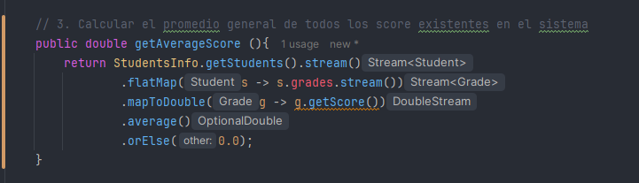
- Obtenemos como resultado lo siguiente
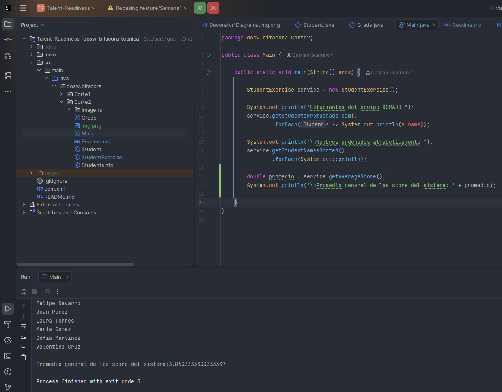
- Generamos el commit y lo subimos al repositorio

### 4. Retornar por estudiante el primedio por materia -> Retornar un Map<String, Double> donde la clave es la materia y el valor el promedio
- Para resolver este ejercicio retomamos un poco la logica del anterior ejercicio
- Obtenemos el Stream< Student>
- Luego con el flatMap obtenemos el Stream< Grade> 
- Hacemos uso del collect para transformar el stream en una estructura final
- Usamos el groupingBy para agrupar las notas por materia 
- Por ultimo con averagingDouble en vez de guardar una lista calculamos el promedio
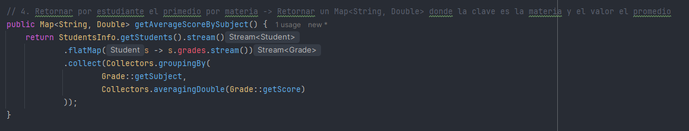
- Nos da como resultado lo siguiente 
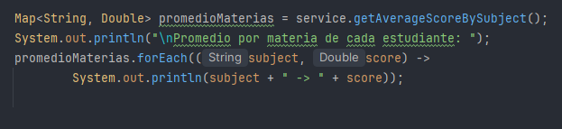
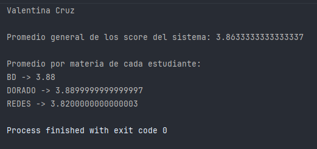

### 5. Retornar el estudiante cuyo promedio general sea el mas alto del curso
Para realizar este ejercicio se tuvo en cuenta lo siguiente 
- Obtenemos los estudiantes convirtiendolos en un stream
- Buscamos el estudiante con el mayor promedio para esto usamos Max 
- Comparamos los estudiantes usando Comparator.comparingDouble()
- Dentro del comparador tomamos las notas de cada estudiante 
- Convertimos cada Grade en su score 
- Sacamos el promedio de sus notas
- Tenemos en cuenta el .orElse en caso de que el estudiante no tenga notas y si no hay estudiantes el null
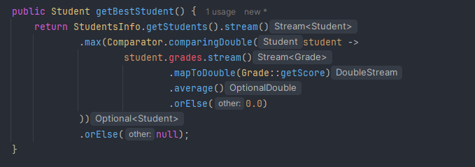
- Obtenemos como resultado de esta ejecucion lo siguiente 
- 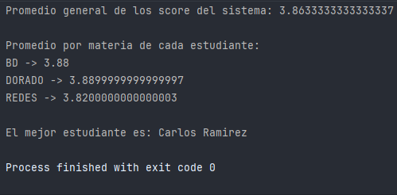

### 6. Retornar las materias reprobadas por equipo -> Retornar Map <String, Long> donde la clave es el nombre del equipo y el valor la cantidad total de materias reprobadas
Para realizar este ejercicio se tuvo en cuenta lo siguiente 
- Obtener los estudiantes convirtiendolos en un stream
- Ir a la coleccion de notas 
- Filtrar por solo los reprobados
- Convertir cada grade en su Team
- Agruparlos por Team
- Contar cada uno 
Tenemos como resultado lo siguiente

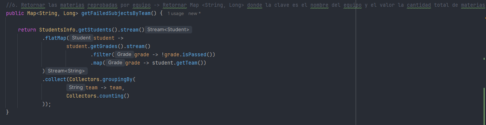

Con la siguiente salida

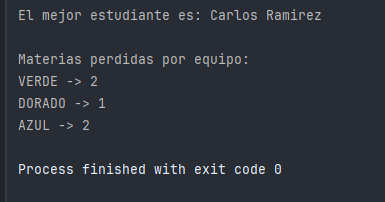

### 7. Top 3 estudiantes con mas materias aprobadas -> Retornar lista ordenada de manera descendente
Para realizar este ejercicio te tuvo en cuenta lo siguiente
- Obtiene la lista de estudiantes usando StudentsInfo.getStudents().

- Convierte la lista en un stream para poder aplicar operaciones sobre los datos.

- Ordena los estudiantes según la cantidad de materias aprobadas (passed = true) que tiene cada uno, de mayor a menor.

- Selecciona los primeros 3 estudiantes con más materias aprobadas usando limit(3).

- Convierte el resultado nuevamente en una lista y la retorna.

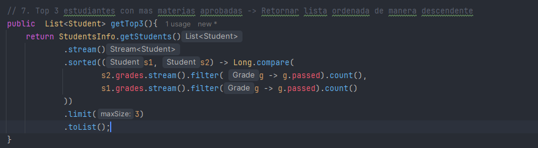

Como resultado tenemos la siguiente salida 

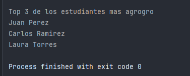

### 8. Agrupar estudiantes por estado academico: Clasificarlos por ALTO RENDIMIENTO -> Promedio >=4,5 , REGULAR ->Promedio entre 3,5 y 4.49, RIESGO -> promedio < 3,5
Para este ejercicio se tomo en cuenta lo siguiente
- Obtiene la lista de estudiantes desde StudentsInfo.getStudents().

- Convierte la lista en un Stream para poder procesar los datos.

- Calcula el promedio de notas de cada estudiante utilizando las calificaciones (grades).

- Clasifica cada estudiante según su promedio en ALTO RENDIMIENTO, REGULAR o RIESGO.

- Agrupa los estudiantes por su estado académico utilizando Collectors.groupingBy, generando un Map donde la clave es el estado y el valor es la lista de estudiantes en ese grupo.

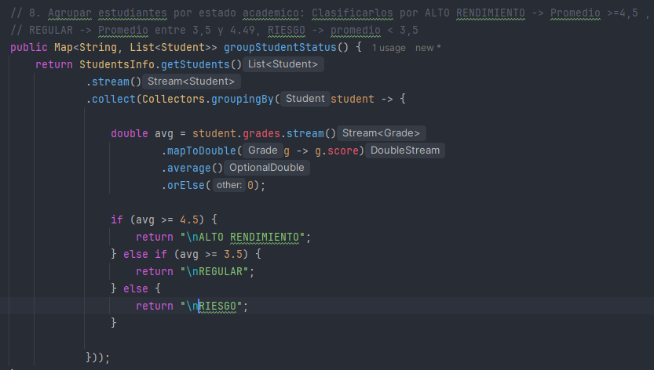

Tenemos como resultado lo siguiente

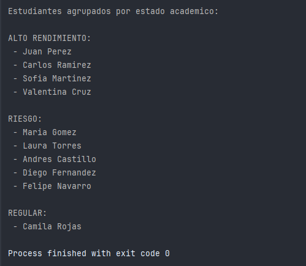

### 9. Obtener la materia con mas reprobaciones
- Obtiene la lista de estudiantes desde StudentsInfo.getStudents()

- Convierte las listas de calificaciones de cada estudiante en un solo flujo usando flatMap, para trabajar con todas las materias del sistema

- Filtra únicamente las materias reprobadas (passed = false)

- Agrupa las materias por su nombre y cuenta cuántas reprobaciones tiene cada una usando groupingBy y counting

- Busca la materia con mayor número de reprobaciones utilizando max y devuelve su nombre

- Si no existen reprobaciones, devuelve el mensaje "No hay reprobaciones"

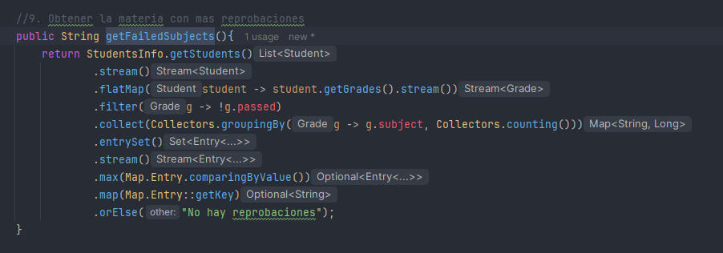

Nos da como salida lo siguiente 

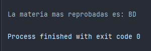

### Tiempo estimado vs real
Mi tiempo estimado para esta actividad siento que va a hacer entre 2 a 3 horas, sin contar el tiempo dedicado para
adjuntar todas las pruebas necesarias en la bitacora

### Reflexion sobre gestion del tiempo

